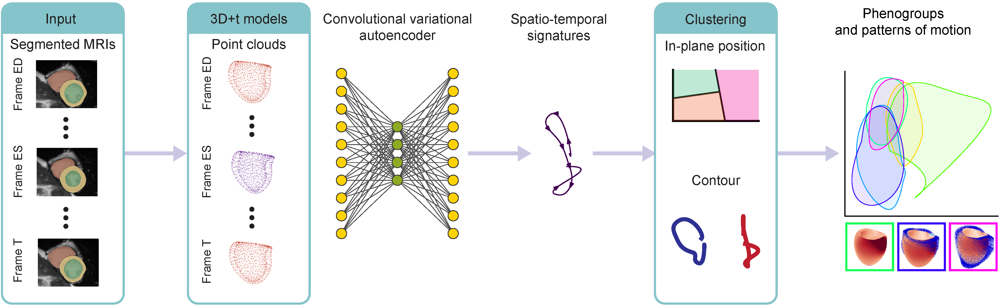

# Human interpretable signatures of three dimensional cardiac motion traits in health and disease

This repository implements the main steps for the generation of cardiac motion signatures and analysis of clinically relevant phenogroups. It transforms cardiac motion data derived from segmented MRIs into human-interpretable signatures.

## Overview

The implementation is organised as follows:

* Pre-processing of time windows of cardiac data and training of the convolution variational autoencoder - [code/cvae_snapshots.py](code/cvae_snapshots.py)
* Post-processing of temporal signatures and clustering (+ stability analysis) - [code/latent_space_clustering.py](code/latent_space_clustering.py)
* Analysis of statistical enrichment of the phenogroups for demographics, biomarkers, cardiovascular risks and outcomes - [code/stat_enrichment.py](code/stat_enrichment.py)
* Generation of three-dimensional phenogroup motion patterns - [code/dynamism_4d.py](code/dynamism_4d.py)
* Benchmark analysis when swapping time windows for MRI-derived features - [codebenchmark_data.py](codebenchmark_data.py)
* Help modules in [utils/](utils/)
